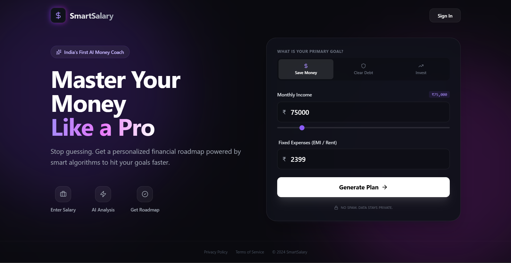
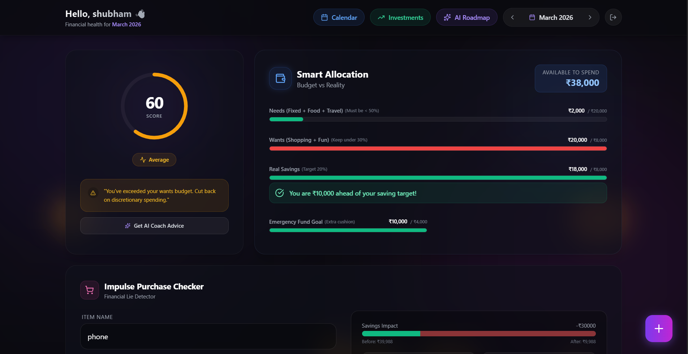

# 🚀 SmartSalary — Your AI Financial Co-Pilot


> **SmartSalary is an AI-powered personal finance operating system**  
> built to help students and working professionals turn their salary into structured wealth using intelligent budgeting, behavior analysis, and adaptive financial roadmaps.

---

## 🖥️ Product Preview

### 🌟 Landing Page  
*AI-powered financial onboarding experience*  


### 📊 Smart Dashboard  
*Live financial health, spending, savings, and AI insights*  


---

## 🧠 What is SmartSalary?

Most finance apps only show **what you spent**.  
SmartSalary tells you **what to do next**.

SmartSalary combines:
- Real-time expense tracking  
- AI-driven financial analysis  
- Behavioral psychology  
- Goal-based budgeting  

to build a **monthly financial game plan** for each user.

It adapts automatically based on:
- Your income
- EMI / loans
- Spending behavior
- Savings gap
- Whether it’s your **first salary month**

---

## 🎯 Core Capabilities

### 🧭 AI Financial Roadmap
Every month, SmartSalary creates a **4-week financial mission plan**:
- Foundation Mode (first salary or new users)
- Growth Mode (healthy finances)
- Discipline Mode (too many impulse buys)
- Correction Mode (overspending)
- Damage Control Mode (negative savings)

Each roadmap contains:
- Weekly goals  
- Spending limits  
- Score rewards & penalties  
- Progress tracking  

---

### 🛍️ Impulse Purchase Checker  
**Your financial lie detector**

Before buying anything:
- Enter product name & price  
- See how it affects:
  - Savings
  - Emergency fund
  - Financial score
  - Delay in financial goals  
- Get AI-generated tradeoffs & warnings  

---

### 📊 Smart Budget Allocation
Your salary is automatically split into:
- Needs
- Wants
- Savings
- Emergency fund
- Investments  

The dashboard tracks:
- Real savings vs target  
- Category-wise spending  
- Monthly trends  
- Spending heatmap  

---

### 💎 Investment Strategy Engine
Get **personalized investment plans**:
- Equity SIPs  
- Safe assets (PPF / Debt)  
- Gold hedge  
With both **user-centric** and **general finance rule** modes.

---

## 🔐 Authentication & Data Layer
- Firebase Authentication (Email / Password)  
- Firestore real-time database  
- Month-wise financial records  
- User-specific AI roadmaps  
- Live syncing across sessions  

---

## 🛠️ Tech Stack

**Frontend**
- React (Vite)  
- Tailwind CSS  
- Lucide Icons  
- Recharts  

**Backend**
- Firebase Authentication  
- Firebase Firestore  

**AI Engine**
- Google Gemini 2.5 Flash API  

---

## ⚙️ How It Works

1. User signs up  
2. Enters income, EMI, and first-salary status  
3. SmartSalary creates a budget plan  
4. User adds expenses  
5. AI analyzes behavior  
6. Roadmap + advice update in real time  
7. Impulse purchases are evaluated before spending
8. Generate Investment Strategy

Everything adapts month-by-month automatically.

---

## 🚀 Running Locally

```bash
git clone https://github.com/Frostcode8/Smart-Salary.git
cd Smart-Salary
npm install
npm run dev
```
Open the application in your browser:
http://localhost:5173

---

## 🌟 Why SmartSalary is Different

Most finance apps only **track** your money.  
SmartSalary actively **guides** it.

**SmartSalary is not:**
- A spreadsheet  
- A boring budget app  
- A passive expense tracker  

**SmartSalary is:**
- A **financial coach**
- A **decision engine**
- A **behavior correction system**
- A **money-management game**

Built for people who want **clarity, control, and long-term financial growth**.


## 🔐 Environment Variables Setup

SmartSalary uses **Google Gemini AI** and **Google Analytics**.  
To run the project locally or in production, you must configure your own keys.

---

## 📄 Step 1: Create a `.env` File

Create a file named `.env` in the root folder of the project and add:

```env
VITE_GEMINI_API_KEY=your_gemini_api_key_here
VITE_GA_ID=your_google_analytics_id_here
```

---

## 🔁 Step 2: Restart the App

After adding the `.env` file, restart the development server:

```bash
npm run dev
```

Your AI features and analytics will now work correctly 🎉

---

## 🔁 Optional: Multiple Gemini API Keys

To avoid quota limits or for backup, you can use multiple keys:

```env
VITE_GEMINI_KEY1=your_key_1
VITE_GEMINI_KEY2=your_key_2
VITE_GEMINI_KEY3=your_key_3
```

---

## 🌐 MVP Live Demo

Try the working MVP here:

👉 **https://smartsalary.netlify.app/**

---